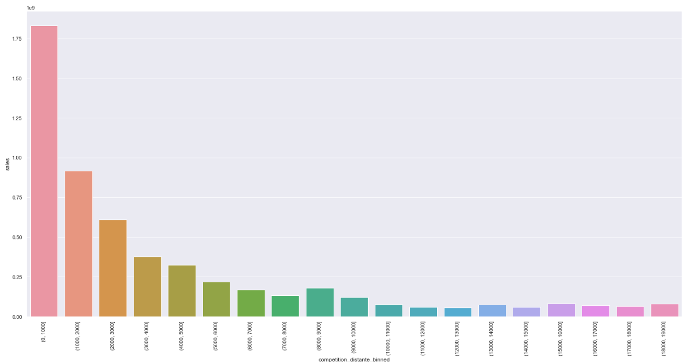
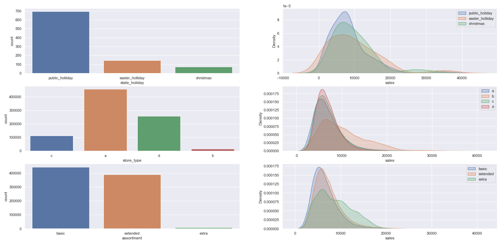
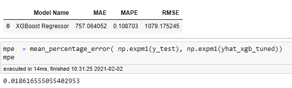
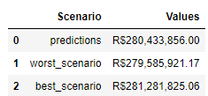

# The Rossmann Sales Forecast

# Business Problem

Rossmann operates over 3,000 drug stores in 7 European countries. Currently, Rossmann store managers are tasked with predicting their daily sales for up to six weeks in advance. Store sales are influenced by many factors, including promotions, competition, school and state holidays, seasonality, and locality. With thousands of individual managers predicting sales based on their unique circumstances, the accuracy of results can be quite varied.

# The Solution Strategy

Develop a Machine Learning Model that predict with 95% accuracy in sales forecast.

**Step 01. Data Description** : Use statistics metrics to identify data distribuctions.

**Step 02. Feature Engieneering** : Create new features on the original that better describe the fenomonous.

**Step 03. Exploratory Data Analysis** : Explore data to find insights and the features that better describe the fenomonous.

**Step 04. Feature Selection** : Select the most importante feature that better describe the fenomonous.

**Step 05. Machine Learning Models** : Machine Learning Model Trainning

**Step 06. Tunning Hyper Parameters** : Find the best values of each parameter of the select Model.

**Step 07. Convert Model Performance to Business Values** : Convert the performance of the Machine Learning model into a business result.

# The Dataset

The dataset is available on kaggle plataform(https://www.kaggle.com/c/rossmann-store-sales/data).

# Top Data Insights 

Sales grow more the shorter the distance to a competitor. 

Sales grow more to store types "A" and "D". 
Sales grow more in public Holidays.
Sales grow more to smaller assortment.

## Machine Learning Models

I used in this step the models:
* Average - Baseline
* Linear Regression
* Lasso Regression
* Random Forest Regressor
* XGBoost Regressor

The perfromance result indicate that i continue with XGBoost and Random Forest Models.

## Models Performance

XGBoost presents the best performance and time of execution, with a accuracity of **98.1%**.

## Convert Model Performance to Business Values

In test data, I calcuted the prediction and comparision with the worst and better cenaries. The model brings a safety data to the CEO decision to sales reform investiment.

# Who i am

My name is Saulo Ferreira Cunha, IT student since 2004 and i'm a Data scientist in formation. 

Email: saulofcunha@outlook.com

Linkedin: https://www.linkedin.com/in/saulo-ferreira-cunha-6a6ba232/